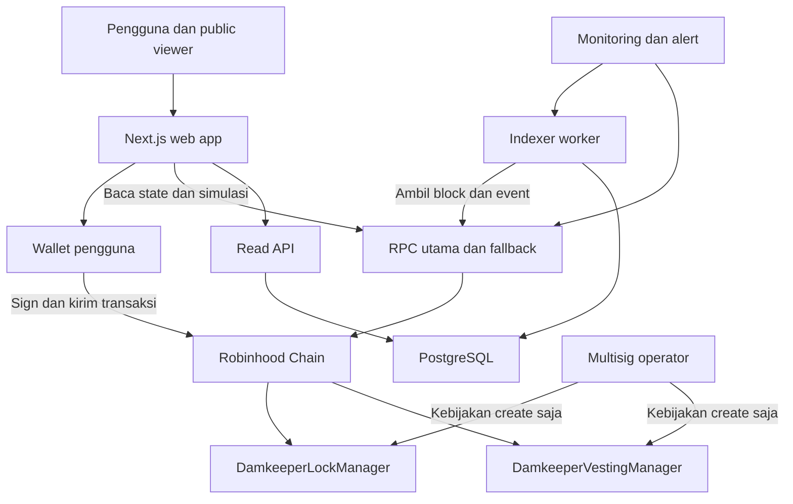

# Damkeeper
# Product, Architecture & Development Brief

**Tanggal:** 28 September 2026  
**Versi:** 1.0  
**Tujuan:** Handoff produk dan engineering untuk membangun Damkeeper secara bertahap dari development, testnet, hingga mainnet.  
**Network:** Robinhood Chain  
**Product descriptor:** Token locks and vesting  
**Tagline:** Hold the supply. Control the release.

> **Status dokumen:** Spesifikasi pengembangan yang direkomendasikan. Nama, arah produk, network, dan identitas hijau berasal dari keputusan project sebelumnya. Detail kontrak dan kebijakan operasional di bawah adalah baseline usulan untuk dibekukan pada fase spesifikasi, bukan klaim bahwa sistemnya sudah dibangun atau diaudit.

---

## 1. Ringkasan konsep

Damkeeper adalah platform untuk mengunci alokasi token dan mengatur kapan token tersebut dapat diambil di Robinhood Chain.

Tim project dapat menyimpan token di smart contract, menetapkan penerima dan jadwal, lalu membagikan halaman bukti publik. Penerima dapat memeriksa haknya dan mengambil token ketika aturan kontrak mengizinkan. Komunitas dapat memeriksa jadwal tanpa harus menghubungkan wallet.

Metaforanya adalah bendungan: token menjadi cadangan yang ditahan, sedangkan kontrak menentukan kapan cadangan tersebut tersedia untuk ditarik.

**Referensi kategori:** Streamflow di Solana dan RobinFlow di Robinhood Chain. Keduanya menjadi referensi cara menyajikan token management. Damkeeper memakai nama, identitas, pengalaman pengguna, dan implementasinya sendiri. Dokumen ini tidak mengasumsikan akses ke kode internal kompetitor.

**Fokus awal:** token lock yang mudah dibuat, mudah diperiksa, dan dapat ditarik sesuai aturan. Linear vesting menjadi modul berikutnya dalam cakupan V1.

## 2. Masalah yang diselesaikan

| Masalah | Solusi Damkeeper |
| --- | --- |
| Tim menjanjikan token tidak akan dijual sebelum tanggal tertentu | Token benar-benar disimpan di kontrak sampai unlock time |
| Pembagian alokasi tim atau kontributor dikelola manual | Vesting menghitung hak penerima berdasarkan waktu |
| Komunitas kesulitan memeriksa alokasi yang dikunci | Halaman publik menampilkan jumlah, penerima, jadwal, dan kontrak |
| Penerima tidak tahu kapan atau berapa token dapat diambil | Dashboard menampilkan status dan jumlah yang dapat ditarik |
| Tampilan platform dan data blockchain berbeda | State kontrak menjadi acuan; data indexer diberi waktu dan block referensi |

**Batas manfaat:** bukti lock hanya membuktikan alokasi tertentu berada dalam kontrak dengan aturan tertentu. Itu bukan jaminan kualitas project, nilai token, atau keamanan seluruh supply. Lock ERC-20 juga tidak otomatis berarti likuiditas DEX terkunci.

## 3. Pengguna dan pengalaman utama

### 3.1 Creator

Founder, treasury manager, atau tim token yang ingin membuat lock atau vesting. Creator memilih token, jumlah, penerima, dan jadwal. Menjadi creator tidak otomatis memberi hak mengambil token jika penerimanya wallet lain.

### 3.2 Beneficiary

Wallet yang berhak menarik token atau melakukan claim. Bisa merupakan wallet creator sendiri atau wallet lain yang ditentukan saat pembuatan.

### 3.3 Public viewer

Holder, anggota komunitas, atau analis yang membuka halaman bukti. Membaca posisi tidak memerlukan login, tanda tangan, atau koneksi wallet.

### 3.4 Platform operator

Mengelola aplikasi, indexing, daftar token yang didukung, dan penerimaan deposit baru. Operator tidak memiliki jalur untuk mengambil escrow, mengganti penerima, mempercepat unlock, atau mengubah jadwal posisi yang sudah dibuat.

## 4. Cakupan produk

### 4.1 V1A: token lock

Fitur minimum untuk sebuah rilis yang lengkap:

1. Connect wallet dan pengecekan network.
2. Pilih ERC-20 yang didukung berdasarkan contract address.
3. Masukkan jumlah, penerima, dan tanggal unlock.
4. Review detail dan exact token approval.
5. Buat lock melalui transaksi wallet.
6. Dashboard posisi milik creator dan penerima.
7. Halaman bukti publik.
8. Withdrawal setelah waktunya tiba.
9. Penanganan transaksi pending, gagal, diganti, dan dibatalkan.
10. Status kontrak, deployment, dan review keamanan yang dapat diperiksa.

### 4.2 V1B: linear vesting

Modul terpisah dengan beneficiary, start, optional cliff, end, preview kurva, claim berulang, serta riwayat claim. Fondasi dashboard, wallet, proof page, dan indexer digunakan kembali.

V1B tidak perlu menahan rilis V1A apabila modul lock sudah memenuhi seluruh syarat rilis. Vesting harus melewati pengujian dan review sendiri sebelum diaktifkan di mainnet.

### 4.3 Di luar V1

- Lock posisi LP berbentuk NFT atau concentrated liquidity.
- Integrasi khusus LP token dari DEX tertentu sebelum adapter dan risikonya ditinjau.
- Staking, yield, airdrop, mint token, payroll massal, atau token launchpad.
- Automatic token transfer, keeper, relayer, gas sponsorship, atau crosschain bridge.
- Cancellation, perubahan beneficiary, top up posisi lama, extension, atau transfer kepemilikan posisi.
- Native ETH escrow. ETH hanya dipakai untuk gas; token wrapper harus memenuhi kebijakan ERC-20.
- Token Damkeeper, tokenomics, atau pendanaan berbasis token sebagai dependensi produk.

Untuk menambah deposit, pengguna membuat posisi baru. Untuk melayani use case baru, rilis versi baru setelah spesifikasinya ditinjau.

## 5. Kebijakan produk yang direkomendasikan

| Area | Baseline pengembangan |
| --- | --- |
| Withdrawal wallet | Default creator; dapat memilih beneficiary lain sebelum transaksi |
| Hak setelah create | Beneficiary tetap, jadwal tetap, jumlah deposit tetap |
| Token lock | Satu unlock time, penarikan penuh sekali oleh beneficiary |
| Vesting | Linear berdasarkan detik, optional cliff, claim oleh beneficiary |
| Cliff | Tidak bisa claim sebelum cliff; pada cliff, akumulasi sejak start tersedia |
| Pembayaran | Pull model: beneficiary mengirim transaksi withdrawal atau claim |
| Upgrade | Kontrak escrow tanpa proxy dan tanpa upgrade di alamat yang sama |
| Token support awal | Token yang ditinjau dan diaktifkan untuk create; bukan semua token dianggap aman |
| Kendali operator | Hanya pause create, admission token, dan batas outstanding deposit baru |
| Claim saat create dipause | Tetap tersedia sesuai aturan kontrak |
| Fee V1 | Platform fee nol; pengguna tetap membayar gas |
| Monetisasi berikutnya | Fee create yang transparan dapat dirancang untuk versi kontrak baru |

Baseline ini mengisi pertanyaan terbuka di master context lama. Product owner dan engineering lead meninjaunya pada fase 0, lalu menyimpan keputusan dalam Architecture Decision Records. Perubahan semantik setelah pembekuan spesifikasi harus memicu review ulang atas kode dan pengujiannya.

**Alasan fee nol di V1:** mengurangi logika pembayaran, konfigurasi treasury, dan kemungkinan salah mengurangi escrow. Jangan mengaktifkan pungutan tersembunyi di frontend atau menambah fee claim setelah pengguna membuat posisi.

---

## 6. Arsitektur sistem



### Pembagian tanggung jawab

| Komponen | Tanggung jawab | Tidak menjadi otoritas untuk |
| --- | --- | --- |
| Kontrak | Menyimpan escrow, terms, accounting, dan hak claim | Harga token atau kualitas project |
| Wallet | Menyetujui dan menandatangani tindakan pengguna | Menentukan ulang aturan kontrak |
| Frontend | Form, preview, simulasi, status transaksi, proof page | Mengubah saldo atau mengesahkan withdrawal |
| Indexer | Menyalin event, mendeteksi reorg, menyusun histori | Menentukan hak atas dana |
| Database/API | Listing, filter, pagination, metadata, cache | Menjadi ledger dana utama |
| Operator | Infrastruktur dan penerimaan posisi baru | Mengakses escrow pengguna |

Jalur penandatanganan langsung dari wallet ke kontrak. Backend tidak menyimpan private key pengguna dan tidak menjadi perantara pemindahan token.

## 7. Stack dan susunan repository

### Stack yang direkomendasikan

| Layer | Pilihan |
| --- | --- |
| Web | Next.js, React, TypeScript |
| Wallet dan RPC client | Wagmi, Viem, TanStack Query |
| UI | CSS/design tokens dari prototype; komponen form dan dialog yang accessible |
| Contracts | Solidity, primitive OpenZeppelin yang relevan |
| Contract tooling | Foundry untuk build, unit test, fuzz, invariant, deployment |
| Indexer | Satu Node.js/TypeScript worker menggunakan Viem |
| Data | PostgreSQL dengan migration yang versioned |
| API | Next.js route handlers untuk read API pada tahap awal |
| CI | Pipeline lint, typecheck, build, contract tests, dan integration checks |
| Observability | Error tracking, structured logs, health checks, dan alert |

Pin compiler, target EVM, library, dan tooling ke versi yang kompatibel dan diuji. Simpan lockfile; jangan mengambil dependency `latest` pada pipeline deploy. Pilihan stack ini tidak menetapkan bahwa versi terbaru setiap package harus langsung dipakai. [S5–S7]

### Struktur monorepo

| Path | Isi |
| --- | --- |
| `apps/web/` | Landing, dashboard, create flows, proof pages, read API |
| `apps/indexer/` | Backfill, event ingestion, checkpoint, reorg, reconciliation |
| `packages/contracts/` | Solidity, Foundry tests, scripts, audit scope |
| `packages/sdk/` | ABI hasil build, typed reads, transaction preparation |
| `packages/config/` | Chain config dan deployment manifests |
| `packages/domain/` | Format unit, validation, istilah status, tipe data |
| `packages/db/` | Schema dan migrations |
| `docs/adr/` | Keputusan produk dan arsitektur beserta alasannya |
| `docs/runbooks/` | Deployment, insiden, restore database, fallback RPC |
| `docs/releases/` | Evidence dan acceptance checklist per rilis |

Mulai dengan satu web service, satu worker, dan satu database. Redis, message broker, microservices, public SDK, serta node blockchain sendiri belum dibutuhkan untuk V1.

## 8. Rancangan smart contract

### 8.1 Dua manager yang terpisah

Gunakan `DamkeeperLockManager` dan `DamkeeperVestingManager`. Masing-masing menyimpan banyak posisi melalui mapping dan counter ID sendiri. Tidak perlu factory atau satu kontrak baru per posisi pada baseline ini.

Manfaatnya adalah jalur create sederhana, biaya deploy lebih kecil, dan event discovery lebih mudah. Konsekuensinya: posisi dalam satu manager berbagi custody kontrak. Bug manager dapat memengaruhi banyak posisi. Testing accounting, pembatasan token, dan review independen menjadi syarat rilis.

Identitas posisi harus lengkap:

`chainId + managerAddress + positionId`

`positionId` saja tidak unik lintas manager, versi, atau network. Simpan juga jenis posisi dan versi deployment pada lapisan data.

### 8.2 Primitive yang digunakan

- `SafeERC20` untuk pemanggilan token yang menangani pola return ERC-20 yang berbeda.
- `ReentrancyGuard` berbasis storage pada semua jalur create/claim/withdraw; jangan mengasumsikan dukungan opcode baru tanpa verifikasi network.
- `Math.mulDiv` atau perhitungan ekuivalen yang ditinjau untuk vesting tanpa overflow perkalian.
- Pola checks, effects, interactions untuk perubahan saldo dan outgoing transfer.
- Kontrol admin minimal dengan transfer kendali dua langkah, dimiliki multisig yang sudah diuji pada chain tersebut.

`SafeERC20` tidak membuktikan bahwa token aman, jujur, atau bebas pajak transfer. OpenZeppelin `VestingWallet` berguna sebagai referensi, tetapi perilaku ownership yang dapat berpindah dan perlakuan deposit tambahan tidak identik dengan fixed beneficiary/fixed deposit Damkeeper. Jangan mengadopsinya tanpa menyesuaikan semantik dan review. [S3–S4]

### 8.3 Data lock

```solidity
struct LockPosition {
    address token;
    address creator;
    address beneficiary;
    uint256 amount;
    uint64 createdAt;
    uint64 unlockTime;
    bool withdrawn;
}
```

Interface konseptual, bukan implementasi siap deploy:

```solidity
function createLock(
    address token,
    address beneficiary,
    uint256 amount,
    uint64 unlockTime
) external returns (uint256 positionId);

function withdraw(uint256 positionId) external;
function getLock(uint256 positionId) external view returns (LockPosition memory);
function withdrawable(uint256 positionId) external view returns (uint256);
```

**Aturan create:**

- Token beralamat kontrak, diaktifkan untuk deposit baru, dan bukan native ETH.
- Beneficiary tidak nol dan bukan alamat manager itu sendiri.
- Amount lebih besar dari nol; unlock time harus berada di masa depan saat transaksi dieksekusi.
- Creator selalu `msg.sender`; sumber token juga `msg.sender`.
- Deposit harus benar-benar diterima sebesar amount sebelum posisi dinyatakan terbentuk.
- Outstanding liability setelah deposit tidak melewati cap token pada manager tersebut.

**Aturan withdraw:**

- Posisi ada; `msg.sender` adalah beneficiary.
- `block.timestamp >= unlockTime` dan posisi belum ditarik.
- Set `withdrawn`, kurangi liability, kemudian transfer seluruh amount ke beneficiary.
- Jika transfer gagal, seluruh transaksi revert sehingga accounting tidak berubah.
- Tidak ada partial withdrawal, early unlock, cancellation, extension, atau perubahan penerima.

Status yang dihitung: `Locked` → `Withdrawable` → `Withdrawn`. Status `Withdrawable` muncul karena waktu, sehingga tidak memerlukan transaksi atau event baru untuk pergantian status.

### 8.4 Data vesting

```solidity
struct VestingPosition {
    address token;
    address creator;
    address beneficiary;
    uint256 totalAmount;
    uint256 claimedAmount;
    uint64 createdAt;
    uint64 startTime;
    uint64 cliffTime;
    uint64 endTime;
}
```

```solidity
function createVesting(
    address token,
    address beneficiary,
    uint256 amount,
    uint64 startTime,
    uint64 cliffTime,
    uint64 endTime
) external returns (uint256 positionId);

function claim(uint256 positionId) external returns (uint256 amount);
function getVesting(uint256 positionId) external view returns (VestingPosition memory);
function vestedAmount(uint256 positionId) external view returns (uint256);
function claimable(uint256 positionId) external view returns (uint256);
```

**Semantik tanggal:**

- `startTime = 0` berarti mulai pada timestamp block transaksi create. Kontrak menyimpan resolved timestamp, bukan nol.
- Start eksplisit harus belum lewat ketika transaksi dieksekusi. UI menyediakan waktu yang cukup untuk approval dan inclusion.
- `endTime > resolvedStartTime`.
- `cliffTime = 0` berarti tanpa cliff.
- Cliff eksplisit wajib `resolvedStartTime < cliffTime < endTime`.
- Tidak ada backdated vesting atau top up dalam V1.
- Untuk start-now, frontend menjelaskan bahwa start final mengikuti block create; preview sebelum konfirmasi merupakan estimasi.

### 8.5 Rumus vesting yang wajib sama di seluruh sistem

Misalkan `A` adalah total deposit dalam unit terkecil token, `S` start, `C` optional cliff, `E` end, `T` timestamp block, dan `R` jumlah yang sudah diklaim.

```text
if T < S:
    vested = 0
else if C != 0 and T < C:
    vested = 0
else if T >= E:
    vested = A
else:
    vested = floor(A * (T - S) / (E - S))

claimable = vested - R
unvested = A - vested
remainingInEscrow = A - R
```

Implementasi Solidity harus memakai perhitungan perkalian/pembagian yang aman terhadap overflow. Pembulatan ke bawah berlaku dalam unit terkecil; cabang `T >= E` membuat seluruh sisa deposit tersedia pada akhir.

**Contoh deterministik:** deposit 1.200 token, durasi 120 hari, cliff hari ke-30. Sebelum hari ke-30, claimable nol. Tepat hari ke-30, 300 token vested. Hari ke-60, 600 token vested; bila sebelumnya sudah claim 300, claimable sekarang 300. Hari ke-120, total 1.200 vested.

Contoh memakai hari berdurasi 86.400 detik. Di UI, tanggal kalender harus dikonversi ke timestamp UTC; jangan menganggap setiap bulan memiliki durasi yang sama.

**Aturan claim:** hanya beneficiary, jumlah claim adalah seluruh claimable saat eksekusi, claim nol revert, accounting diubah sebelum transfer, dan tidak ada argumen recipient yang dapat mengalihkan tujuan transfer.

Status yang dihitung: `Scheduled`, `Cliff pending`, `Vesting`, `Fully vested`, `Fully claimed`. `Fully vested` belum tentu `Fully claimed`.

## 9. Accounting, token support, dan admin

### 9.1 Accounting per token, per manager

Simpan `totalLiability[token]` sebagai total kewajiban kontrak yang belum dibayar. Nilainya naik saat deposit posisi baru dan turun saat payout berhasil.

Invariants untuk token yang didukung:

```text
0 <= claimedAmount <= totalAmount
0 <= vestedAmount <= totalAmount
sum(outstanding positions for token) == totalLiability[token]
balanceOf(manager, token) >= totalLiability[token]
```

Gunakan `>=` karena seseorang dapat mengirim token langsung tanpa membuat posisi. Transfer langsung tidak menciptakan posisi, tidak menambah hak beneficiary, dan tidak boleh meningkatkan deposit tercatat posisi mana pun. Tidak ada fungsi rescue/sweep dalam V1; UI harus mengarahkan deposit melalui create flow saja.

### 9.2 Kebijakan token

- Mainnet awal menerima daftar token yang ditinjau, diaktifkan onchain per manager.
- Cek balance sebelum dan sesudah deposit; wajib `received == requested`.
- Pada payout, validasi balance delta manager dan beneficiary sebesar amount untuk token yang didukung. Ketidakcocokan menyebabkan revert; uji aturan ini dengan reviewer dan fixture token.
- Rebase, transfer tax, reflection, dan perilaku tidak kompatibel berada di luar dukungan awal.
- Token issuer dapat memiliki kemampuan pause, blacklist, mint, atau upgrade. Risiko issuer ini harus dicatat; platform tidak bisa menjamin token tidak berubah perilakunya kemudian.
- Pembacaan bytecode, simulasi, atau delta saat ini tidak dapat mendeteksi seluruh perilaku masa depan maupun token jahat yang memalsukan laporan saldo.
- Token dengan nama/ticker sama tidak dianggap identik; alamat kontrak dan chain selalu ditampilkan.
- Dukungan stock token atau token dengan transfer restrictions memerlukan pemeriksaan khusus sebelum diaktifkan.

Disable token hanya menutup pembuatan posisi baru. Withdrawal dan claim posisi lama tidak boleh memeriksa apakah token masih enabled. Token yang dibekukan oleh issuer sendiri tetap dapat membuat payout gagal; jelaskan batas ini secara faktual.

### 9.3 Hak admin yang terbatas

Interface kebijakan minimal pada masing-masing manager:

```solidity
function setCreationPaused(bool paused) external;
function setTokenPolicy(address token, bool enabled, uint256 liabilityCap) external;
```

Keduanya hanya dapat dipanggil admin. Default deployment: create dipause, tidak ada token enabled, cap nol. Kebijakan enable memerlukan cap lebih besar dari nol.

- Cap adalah batas outstanding token dalam raw units, bukan batas USD.
- Menurunkan cap di bawah liability saat ini hanya mencegah deposit baru; tidak mengubah hak posisi lama.
- Cap berlaku per token pada masing-masing manager. Batas gabungan lintas manager harus dihitung dan ditinjau dalam konfigurasi rilis.
- Semua perubahan policy dan pause mengeluarkan event.
- Pause tidak diterapkan pada claim atau withdraw. Hindari modifier global yang diam-diam mengunci jalur keluar.
- Tidak ada arbitrary call, delegatecall, sweep escrow, privileged claim, atau perubahan schedule oleh admin.
- Rotasi admin dilakukan dua langkah; mainnet tidak menggunakan hot wallet deployer sebagai admin permanen.

**Batas tanggap insiden:** karena payout tidak bisa dipause dan kontrak tidak bisa diupgrade, bug pada jalur payout tidak dapat dihentikan dengan tombol admin. Tradeoff ini harus masuk threat model dan review independen sebelum mainnet.

### 9.4 Event minimum

| Event | Field yang harus dapat direkonstruksi |
| --- | --- |
| `LockCreated` | ID, token, creator, beneficiary, amount, createdAt, unlockTime |
| `LockWithdrawn` | ID, beneficiary, amount |
| `VestingCreated` | ID, token, creator, beneficiary, amount, resolved start, cliff, end, createdAt |
| `VestingClaimed` | ID, beneficiary, amount, cumulative claimed |
| `CreationPauseChanged` | paused, actor |
| `TokenPolicyChanged` | token, enabled, liabilityCap, actor |
| Admin transfer events | previous/pending/new admin sesuai tahapan transfer |

Untuk event create, rekomendasi tiga field indexed: position ID, token, dan creator. Beneficiary tetap masuk event data dan diberi index database. `chainId`, manager address, block number/hash, transaction hash/index, dan log index berasal dari envelope log RPC, bukan perlu diulang pada semua event.

---

## 10. Frontend dan user flows

### Halaman

| Route konseptual | Fungsi |
| --- | --- |
| `/` | Landing dan pengenalan produk |
| `/app` | Dashboard wallet |
| `/app/lock/new` | Create token lock |
| `/app/vesting/new` | Create vesting, ketika modul diaktifkan |
| `/positions` | Explore dengan filter network dan jenis |
| `/positions/:chainId/:manager/:id` | Public proof dan action beneficiary |
| `/transparency` | Deployment, source, versi, token policy, review |
| `/status` | Status aplikasi dan indexing yang benar-benar diukur |

### Create lock

1. Pilih network dan connect wallet bila ingin create.
2. Pilih token; baca address, decimals, saldo, allowance, serta policy kontrak.
3. Isi amount, beneficiary, dan tanggal unlock. Tampilkan UTC dan waktu lokal dengan label jelas.
4. Review token, jumlah, penerima, waktu, alamat spender, gas estimasi, dan platform fee nol.
5. Jika allowance kurang, approve exact amount; token tertentu mungkin memerlukan reset allowance ke nol terlebih dahulu.
6. Setelah receipt approval, baca allowance dan simulasi ulang create.
7. Kirim create; tampilkan hash dan status inclusion.
8. Ambil position ID dari receipt log manager yang benar; tampilkan proof page meski indexer belum menyusul.

Approval yang sudah ada dapat dipakai jika mencukupi. Jangan meminta ulang approval yang tidak diperlukan. Setelah account atau chain berubah, batalkan prepared transaction lokal dan ulangi review; jangan mengirim otomatis.

### Create vesting

Gunakan alur yang sama, dengan beneficiary, start, optional cliff, dan end. Preview menampilkan jumlah yang tersedia pada start, cliff, titik tengah, dan end. Sebelum tanda tangan, tampilkan penjelasan cliff yang dipilih dalam bahasa biasa.

### Claim atau withdraw

Baca ulang state kontrak dan timestamp block → pastikan wallet berhak → hitung/display jumlah → simulasi → pengguna menandatangani → tunggu receipt → baca ulang state → sinkronkan cache.

Nominal UI dapat berubah ketika waktu berjalan. Nominal final claim mengikuti timestamp block transaksi, dan harus ditampilkan dari receipt/state sesudah eksekusi.

### Status transaksi

`Review` → `Awaiting wallet` → `Submitted` → `Included` → `Indexed`.

Branch lain: `User rejected`, `Reverted`, `Replaced`, `Cancelled`, `Unknown / awaiting RPC recovery`. Timeout RPC tidak otomatis berarti transaksi gagal. Cek receipt, nonce, atau hash pengganti sebelum menawarkan retry create agar tidak membuat dua posisi.

### Ketentuan UX dan keamanan web

- Membuka dashboard publik/proof page tidak memerlukan signature.
- SIWE/session login belum diperlukan untuk fitur read/create dasar.
- Amount memakai BigInt atau decimal string; jangan lewat JavaScript `Number` untuk raw token units.
- Metadata token dianggap input tidak tepercaya: batasi panjang, escape teks, sanitasi/proxy gambar, jangan render HTML token.
- Logo, ticker, atau tampilan professional bukan bukti token aman.
- Network label selalu terlihat; tombol submit diblokir pada network yang salah.
- Tidak menggunakan infinite approval sebagai default.
- Tersedia state kosong, insufficient balance, insufficient gas, RPC down, indexer lag, wrong account, unsupported token, pause create, serta allowance berubah.
- Form dan dialog dapat digunakan dengan keyboard; desktop dan mobile menjadi bagian acceptance.

## 11. Indexer, API, dan data

### 11.1 Pipeline

Worker melakukan backfill mulai dari deployment block, kemudian polling range block baru. Websocket boleh menjadi pemicu pembaruan, tetapi bukan satu-satunya mekanisme agar event yang terlewat tetap tertangkap.

1. Ambil block header dan event untuk manager yang tercantum pada manifest.
2. Periksa chain ID dan kontinuitas parent hash.
3. Simpan raw event dan proyeksi posisi dalam transaksi database.
4. Update checkpoint hanya setelah batch lengkap berhasil disimpan.
5. Rekonsiliasi posisi yang berubah dan liability dengan contract reads pada block referensi yang sama.

Event ingestion harus idempotent. Simpan identity raw event dengan chain ID, block hash, transaction hash, dan log index. Simpan urutan block/transaction/log; jangan mengandalkan waktu penerimaan event.

### 11.2 Reorg dan finality

Simpan rolling block hashes. Saat hash/parent tidak cocok, cari common ancestor, tandai atau hapus proyeksi canonical dari block yang tergantikan, kemudian replay event canonical. Uji juga receipt yang sebelumnya terlihat lalu hilang atau berpindah.

Robinhood Chain membedakan penerimaan sequencer, publikasi ke Ethereum, dan finality Ethereum. Receipt pertama tidak boleh dilabeli sebagai finality Ethereum. Tentukan policy confirmation dan replay window berdasarkan dokumentasi network serta kemampuan RPC yang dipilih; jangan menebak angka block universal. Jika metadata finality tidak tersedia, tampilkan tingkat yang diketahui saja. [S2]

State vesting berubah seiring waktu meski tidak ada event. API harus menghitung ulang derived amounts memakai timestamp block referensi atau memanggil view kontrak. Timestamp yang dipakai dan freshness data harus tercantum.

### 11.3 Tabel minimum

| Tabel | Data utama |
| --- | --- |
| `deployments` | Chain, manager, jenis, versi, deployment tx/block, ABI/source commit |
| `tokens` | Chain, address, metadata, decimals, dukungan dan catatan perilaku |
| `positions` | Composite key, creator, beneficiary, terms, deposit, cumulative payout |
| `position_events` | Raw log identity, canonical flag, payload, block/transaction order |
| `chain_checkpoints` | Last processed block/hash dan reference confirmation tier |
| `token_policies` | Manager, token, enabled, cap, block perubahan terakhir |

Nominal EVM disimpan sebagai decimal string atau `NUMERIC(78,0)`. Simpan alamat dalam bentuk ternormalisasi untuk query, lalu tampilkan checksum address di UI. Index query creator dan beneficiary dengan chain/manager agar tidak terjadi pencampuran network.

### 11.4 Read API

```text
GET /api/positions?chainId=&wallet=&role=creator|beneficiary&type=&cursor=
GET /api/positions/:chainId/:manager/:id
GET /api/positions/:chainId/:manager/:id/events?cursor=
GET /api/tokens?chainId=&manager=
GET /api/deployments?chainId=
GET /api/health
```

Respons posisi menyertakan `asOfBlock`, `asOfBlockHash`, `asOfTimestamp`, `indexedAt`, `confirmationTier`, dan `stale`. Jumlah dikirim sebagai string. Gunakan pagination dan rate limit; hindari endpoint yang mengembalikan seluruh database.

Dashboard memakai API untuk discovery, lalu frontend memvalidasi data yang kritis terhadap transaksi lewat contract read. Backend tidak menyediakan endpoint yang memindahkan dana atas nama pengguna.

## 12. Network, deployment, dan environment

Konfigurasi berikut diperiksa dari dokumentasi resmi pada 28 September 2026. Periksa ulang sebelum setiap deployment. [S1]

| Properti | Testnet | Mainnet |
| --- | --- | --- |
| Chain ID | `46630` | `4663` |
| Gas token | ETH | ETH |
| Explorer | `https://explorer.testnet.chain.robinhood.com` | `https://robinhoodchain.blockscout.com` |
| RPC provider, contoh resmi | `https://robinhood-testnet.g.alchemy.com/v2/{API_KEY}` | `https://robinhood-mainnet.g.alchemy.com/v2/{API_KEY}` |

Dokumentasi koneksi saat ini mengarahkan developer ke provider RPC, termasuk Alchemy. Pilih endpoint utama dan fallback dari provider berbeda; ukur reliability dan biaya sebelum menentukan paket. Historical reads/indexing perlu dukungan archive sesuai kebutuhan. Public RPC yang tercantum dalam brief lama tidak dijadikan dependensi tunggal produksi.

### Pemisahan environment

| Environment | Network dan penggunaan |
| --- | --- |
| Local | Local EVM/Anvil dan mock token untuk pengujian deterministik |
| Preview | UI sementara; tidak boleh melakukan transaksi mainnet |
| Testnet | Deployment kontrak dan database testnet tersendiri |
| Mainnet | Manifest, database, worker, RPC credential, dan admin production tersendiri |

Setiap manifest deployment menyimpan chain ID, manager address, version, ABI hash, source commit, compiler settings, deployment tx/block, verified-source URL, admin, token policy, cap, dan review report bila tersedia.

Alamat deployment belum tersedia dan tidak boleh dikarang. Frontend harus gagal dengan jelas jika konfigurasi network/bytecode/manifest tidak cocok, bukan memakai alamat default network lain.

**Testnet tidak berubah menjadi mainnet.** Mainnet adalah deployment baru. Posisi, saldo test token, dan histori testnet tidak dipindahkan otomatis. Dashboard dan URL harus menjaga batas keduanya.

## 13. Reliability dan respons insiden

### Pantau

- RPC error rate, latency, chain ID, block progress, dan failover.
- Indexer lag, checkpoint yang berhenti, reorg, dan hasil reconciliation.
- Saldo manager terhadap liability per token.
- Pola create/claim/withdraw gagal dan perubahan policy admin.
- Status frontend/API, database backup, serta restore terakhir yang diuji.
- Pemakaian cap, token yang berubah perilakunya, dan error transfer baru.

### Jika terjadi masalah

| Kejadian | Tindakan |
| --- | --- |
| RPC utama bermasalah | Pindah ke fallback; hentikan write jika network/state tidak dapat dipastikan |
| Indexer tertinggal | Label data stale, gunakan contract read untuk detail, backfill dari checkpoint |
| Backend down | Direct contract access tetap didokumentasikan; discovery dashboard dapat terganggu |
| Token berubah perilaku | Hentikan create token tersebut, tampilkan status, selidiki dampak pada payout |
| Kerentanan manager | Pause create onchain, nonaktifkan create frontend, umumkan fakta, ikuti runbook |
| Bug UI/API | Rollback aplikasi setelah memastikan manifest tetap sesuai deployment |

Rollback aplikasi tidak membatalkan transaksi blockchain. Kontrak immutable yang bermasalah memerlukan versi deployment baru; dana pada posisi lama tidak dapat dipindahkan paksa oleh operator. Jangan menjanjikan emergency rescue yang tidak ada di kontrak.

---

## 14. Strategi pengujian

### 14.1 Contract unit tests

| Area | Kasus wajib |
| --- | --- |
| Lock timing | Sebelum unlock, tepat unlock, sesudah unlock |
| Authorization | Creator berbeda dari beneficiary; penyerang tidak bisa mengambil dana |
| Withdrawal | Full payout sekali; percobaan kedua revert |
| Vesting | Sebelum start, tepat start, sebelum/tepat/sesudah cliff, midpoint, tepat/sesudah end |
| Claim | Berulang, claim nol, pembulatan raw units, sisa akhir habis |
| Input | Nol address/amount, waktu terbalik, start-now, start eksplisit kedaluwarsa |
| ERC-20 | Return false, no return data, transfer fee, rebase, callback/reentrancy, transfer blocked |
| Admission | Token disabled, cap tercapai, cap diturunkan, create dipause |
| Exit | Claim/withdraw tetap bekerja saat create dipause atau token dinonaktifkan |
| Isolation | Banyak posisi, token berbeda, creator dan beneficiary berbeda |
| Direct transfer | Donasi tidak menciptakan posisi atau mengubah hak posisi lain |

### 14.2 Fuzz dan invariant tests

Jalankan urutan acak create, time advance, claim, withdraw, policy update, dan direct transfer. Assert seluruh invariant accounting pada bagian 9 untuk token dengan perilaku yang didukung.

Gunakan model perhitungan independen sebagai pembanding vesting; jangan hanya menyalin rumus implementasi ke expected result. Untuk token tidak kompatibel, assert rejection/revert atau documented failure, bukan memaksakan jaminan solvabilitas yang tidak mungkin diberikan token tersebut.

### 14.3 Integration dan frontend

- Dua account berbeda dan token decimals 6, 8, 18.
- Jumlah besar tanpa precision loss.
- Approval berhasil tetapi create gagal; state harus bisa dipulihkan.
- Account/network diganti saat modal wallet terbuka.
- Transaksi direject, direplace, timeout, serta reload setelah submit.
- Proof page dapat dibaca tanpa wallet dan ketika indexer terlambat.
- Duplicate logs, worker restart, full replay, dan simulasi reorg.
- Failover RPC dan restore database.
- Form, menu, chart, dialog, dan tombol claim di desktop/mobile serta keyboard.
- Mainnet build tidak memuat demo positions sebagai data sungguhan.

### 14.4 Review keamanan

Threat model, contract source, deployment scripts, token assumptions, admin privileges, dependency versions, dan exact release commit menjadi scope review. Sebelum menerima dana pengguna mainnet, perlu review independen yang kompeten, perbaikan temuan, dan verifikasi ulang perbaikannya.

Testing testnet bukan pengganti review keamanan. Penggunaan library OpenZeppelin juga tidak berarti kontrak Damkeeper otomatis sudah diaudit.

## 15. Fase pengembangan dan syarat kelulusan

Fase mengikuti hasil yang dapat diperiksa. Durasi kalender baru diestimasi setelah tim dan scope rilis dipastikan; tenggat marketing tidak menggantikan exit gate.

### Fase 0 — Product specification dan foundation

**Kerja:** bekukan V1A/V1B, aturan beneficiary, immutable terms, cliff, token policy, cap, fee nol, dan kewenangan admin. Buat threat model, ADR, route map, repo, CI, chain config, dan deployment schema.

**Deliverable:** spesifikasi kontrak, acceptance scenarios, struktur repository, design tokens, daftar keputusan.

**Lulus jika:** product dan engineering memahami contoh perhitungan yang sama; tidak ada pertanyaan tentang siapa yang boleh mengambil dana atau mengubah jadwal; initial backlog memiliki owner dan dependensi.

### Fase 1 — Local implementation: token lock

**Kerja:** implementasi LockManager, supported token policy, accounting, event, Foundry tests, wallet flow, dan proof page dari data kontrak local.

**Deliverable:** flow local create → tunggu unlock → withdraw → proof yang konsisten.

**Lulus jika:** semua lock tests dan invariant lolos; unauthorized/double withdrawal gagal; exact approval, parsing receipt, dan amount formatting bekerja. Aplikasi build dan CI hijau.

### Fase 2 — Robinhood Chain testnet alpha

**Kerja:** deploy kandidat LockManager ke testnet, verify source, deploy mock ERC-20 dengan beberapa decimals, aktifkan indexer/database, lalu hubungkan UI dengan kontrak asli.

**Deliverable:** manifest testnet, link source terverifikasi, tx create/withdraw, dashboard, dan proof page publik testnet.

**Skenario:** lock singkat 2–10 menit untuk demonstrasi, ditambah posisi yang hidup lintas hari untuk recovery dan monitoring. Gunakan wallet creator dan beneficiary berbeda.

**Lulus jika:** alur end to end selesai melalui wallet; testnet benar-benar bertransaksi; proof sesuai kontrak; restart worker tidak menggandakan event; perubahan account/network ditangani; semua transaksi contoh memiliki hash nyata.

### Fase 3 — Testnet beta dan vesting

**Kerja:** tambahkan VestingManager jika masuk batch rilis; uji cliff dan claim berulang; lakukan wallet compatibility, mobile, failover, reorg/replay, security hardening, dan user acceptance testing.

**Deliverable:** kandidat rilis, test report, daftar bug, rekaman demo nyata, runbook, serta inventory token assumptions.

**Target evidence operasional yang diusulkan:** 10 wallet uji, setidaknya 100 flow berhasil pada berbagai skenario, dua keluarga wallet, dan 72 jam observasi dengan rekonsiliasi bersih. Angka ini adalah target pengamatan, bukan bukti keamanan atau ukuran minimum yang otomatis menjamin layak mainnet.

**Lulus jika:** seluruh skenario wajib lulus; tidak ada blocker kritis; perbedaan saldo sudah diselesaikan; database dapat direbuild dari event; jalur keluar tetap bekerja saat create dipause. Jika vesting belum siap, pisahkan release candidate lock.

### Fase 4 — Mainnet readiness

**Kerja:** freeze source commit, dependency dan compiler settings; jalankan independent review; selesaikan dan retest temuan; finalisasi RPC, multisig, token list, caps, monitoring, dan deployment rehearsal.

**Deliverable:** release checklist, review report/scope, manifest template, admin roster, token policy, cap raw units, incident owner, dan rollback/runbook.

**Lulus jika:** tidak ada temuan Critical/High yang belum diselesaikan; temuan lain diberi resolusi atau penerimaan risiko tertulis; bytecode dapat direproduksi; admin signing diuji; deployment dan verification rehearsal berhasil. Review harus mencakup kode yang akan dideploy.

Jika resource review belum tersedia, lanjutkan validasi testnet dan tunda penerimaan dana pengguna mainnet.

### Fase 5 — Mainnet pilot

**Kerja:** deploy kontrak versi baru ke mainnet dalam keadaan create dipause. Verify source dan bytecode, konfirmasi admin, isi token policy/cap yang disetujui, kemudian buka create secara terkontrol. Jalankan smoke test dengan dana kecil milik tim sebelum onboarding eksternal.

**Deliverable:** alamat mainnet, deployment tx, verified source, actual create/withdraw proof, status page, serta review disclosures.

**Lulus jika:** smoke flow lengkap berhasil, hak admin tepat, tidak ada mismatch accounting, indexer dan fallback berfungsi, serta setiap cap tercatat dan enforced oleh kontrak. Pilot dapat dimulai dengan LockManager saja.

**Catatan:** banner beta atau pembatasan di frontend saja tidak membatasi direct contract access. Perlindungan penerimaan deposit harus berada pada onchain policy/cap.

### Fase 6 — Public mainnet dan operasi

**Kerja:** perluas onboarding dan token support secara bertahap; aktifkan vesting hanya setelah gate modulnya lulus; publikasikan docs dan proof; pantau reliability, payout failures, dan kualitas UX.

**Deliverable:** produk public mainnet dengan release notes, monitoring, incident response, dan backlog terurut.

**Lulus sebagai rilis awal:** pengguna dapat membuat, memeriksa, dan mengambil token sesuai rules; hak akses dan accounting sesuai; data publik dapat ditelusuri; tim punya prosedur maintenance. Launch announcement mengikuti evidence, bukan mendahuluinya.

## 16. Urutan kerja developer

| Urutan | Work package | Bergantung pada | Bukti selesai |
| --- | --- | --- | --- |
| 1 | ADR produk, threat model, deployment schema | Brief ini | Aturan dan acceptance examples disepakati |
| 2 | LockManager dan unit/invariant tests | 1 | Test report dan review internal |
| 3 | Token fixtures, deploy scripts, generated ABI | 2 | Local deployment reproducible |
| 4 | Wallet, review, approval, create/withdraw UI | 1, 3 | Alur local lengkap |
| 5 | Indexer, schema, checkpoint, reorg | Event schema 2 | Replay menghasilkan state yang sama |
| 6 | Dashboard dan public proof | 4, 5 | Data konsisten dengan contract reads |
| 7 | Testnet release | 2–6 | Verified source dan actual tx proof |
| 8 | VestingManager dan UI | 1, fondasi 2–6 | Formula, cliff, repeated claim lulus |
| 9 | Reliability, security review, UAT | Kandidat modul yang dirilis | Readiness checklist ditandatangani |
| 10 | Mainnet pilot | 9 | Smoke flow, monitoring, policy aktif |
| 11 | Public rollout | Pilot stabil | Docs, release notes, dan proof nyata |

Desain dan layout dapat dikerjakan bersamaan dengan kontrak setelah semantik dibekukan. Integrasi transaksi harus memakai ABI yang dihasilkan build, bukan fungsi yang ditebak dari prototype.

## 17. Mainnet release checklist

- [ ] Scope modul yang diluncurkan dan commit rilis ditetapkan.
- [ ] Seluruh acceptance scenario, fuzz, invariant, dan integration gates lolos.
- [ ] Review independen sesuai release scope selesai; temuan ditangani.
- [ ] Chain ID, RPC, manager address, ABI, dan bytecode cocok dengan manifest.
- [ ] Source dan deployment transaction dapat dibuka di explorer.
- [ ] Admin multisig telah menerima kendali; deployer tidak menyisakan hak tak terdokumentasi.
- [ ] Token policies, raw-unit caps, serta total exposure lintas manager ditinjau.
- [ ] Pause create tidak memblokir claim/withdraw.
- [ ] RPC fallback, indexer replay, reconciliation, dan restore telah diuji.
- [ ] Monitoring serta incident owner tersedia.
- [ ] UI memisahkan demo, testnet, dan mainnet.
- [ ] Claim “audited” hanya muncul jika laporan audit yang relevan memang ada.
- [ ] Smoke create dan payout mainnet berhasil sebelum public onboarding.
- [ ] Dokumentasi direct contract access tersedia untuk kondisi frontend down.

## 18. Design handoff dan status aset

Aset project yang sudah dibahas:

- Master context dan brief produk awal.
- Prototype landing HTML yang telah dipoles, termasuk demo lock/vesting dan posisi contoh.
- Konsep logo Damkeeper dan simbol D terpisah dengan warna lime green.

Gunakan prototype sebagai referensi layout, typography, warna, dan interaksi. Demo dalam HTML bukan smart contract, bukan data testnet, dan bukan bukti mainnet sudah aktif.

Identitas visual: simbol D dengan aliran tertahan oleh gate, latar forest gelap, hijau lime sebagai aksen, typography bersih, serta angka dan tanggal yang mudah diperiksa. Buat aset vektor produksi dari logo yang dipilih sebelum integrasi brand final; raster konsep tidak otomatis menjadi master SVG.

Halaman publik tidak mengaitkan Damkeeper dengan gangguan kompetitor atau mengklaim dukungan resmi Robinhood. Pesan utamanya tetap fungsi produk dan bukti yang dapat diperiksa.

## 19. Keputusan yang harus dicatat sebelum contract freeze

| Keputusan | Default yang direkomendasikan | Penanggung jawab |
| --- | --- | --- |
| Rilis pertama | LockManager lebih dahulu; vesting dapat menyusul | Product owner |
| Penerima | Default creator, pilihan beneficiary tetap sebelum create | Product + contract lead |
| Term mutation | Tidak ada perubahan sesudah create | Contract lead |
| Cliff | Catch-up sejak start pada cliff, sesuai formula bagian 8 | Product + contract lead |
| Fee | Nol platform fee pada V1 | Product owner |
| Admission | Token ditinjau dan diaktifkan onchain | Product + security lead |
| Pilot exposure | Cap per token/per manager, angka ditentukan sebelum aktivasi | Product + operations |
| Admin | Multisig dengan signer dan threshold terdokumentasi | Operations |
| RPC | Primary dan fallback berbeda provider | Engineering |
| Review | Reviewer, scope, jadwal, dan budget ditetapkan sebelum readiness gate | Product + engineering |

Tidak perlu menunggu keputusan vendor untuk membangun local flow. Namun nilai cap, admin, vendor produksi, dan review harus konkret sebelum mainnet diaktifkan.

## 20. Definition of done

Damkeeper siap disebut produk token lock ketika pengguna dapat menyelesaikan rangkaian berikut pada network yang dinyatakan:

**Pilih token → review aturan → approve → create → buka public proof → tunggu unlock → withdraw ke beneficiary yang benar.**

Vesting menambah rangkaian **buat jadwal → lewati cliff bila ada → claim → claim sisa sampai selesai**.

Dana dan hak pengguna ditentukan kontrak; UI menampilkan keadaan secara akurat; histori dapat direkonstruksi; deployment dapat diverifikasi; serta tim memahami cara menangani gangguan. Keindahan landing page menjadi pendukung pengalaman tersebut.

---

## Sumber dan referensi

Referensi diperiksa pada 28 September 2026. Pilihan desain Damkeeper di atas adalah rekomendasi project, bukan klaim bahwa referensi mengimplementasikan arsitektur yang sama.

- **[S1]** [Robinhood Chain: Connecting](https://docs.robinhood.com/chain/connecting/) — network IDs, explorer, provider endpoints, historical reads.
- **[S2]** [Robinhood Chain: Transaction Finality](https://docs.robinhood.com/chain/transaction-finality/) — tahapan confirmation dan finality.
- **[S3]** [OpenZeppelin: ERC-20](https://docs.openzeppelin.com/contracts/5.x/api/token/erc20) — ERC-20 interfaces, units, dan SafeERC20.
- **[S4]** [OpenZeppelin: Finance](https://docs.openzeppelin.com/contracts/5.x/api/finance) — VestingWallet, cliff, ownership, dan perilaku deposit tambahan.
- **[S5]** [OpenZeppelin: Access Control](https://docs.openzeppelin.com/contracts/5.x/access-control) — kontrol akses kontrak.
- **[S6]** [Wagmi: Getting Started](https://wagmi.sh/react/getting-started) — integrasi React, Viem, dan TanStack Query.
- **[S7]** [Next.js Documentation](https://nextjs.org/docs) — framework frontend.
- [Robinhood Chain: Deploy a Contract](https://docs.robinhood.com/chain/deploy-smart-contracts/) — deployment dan verification tooling.
- [Streamflow](https://streamflow.finance/) — referensi kategori dan pengalaman produk.
- [RobinFlow](https://robinflow.app/app) — referensi kategori di Robinhood Chain; tidak dipakai sebagai sumber spesifikasi keamanan internal.
- Konteks internal: `Damkeeper_Master_Context.md`, brief produk awal, dan keputusan lanjutan dalam percakapan Damkeeper.

